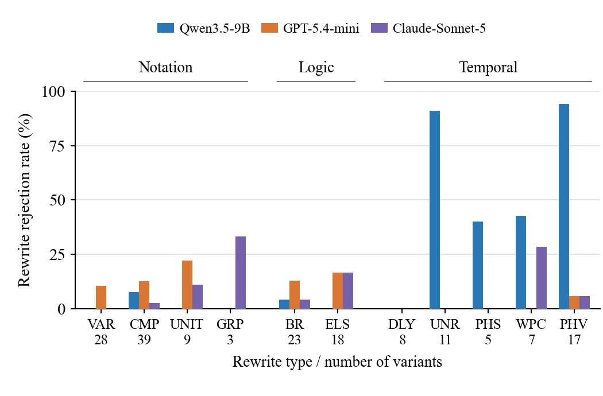

# Problem and Motivation — 한글 검토본

§1과 §2를 종합하면 과제는 명확하다. 배포 전에 생성된 코드가 사용자의 의도한 행동 명세를 보존하는지 판단하는 관문이 필요하다. 이 절에서는 먼저 우리 환경에서 이러한 관문이 충족해야 하는 요구사항을 정리한다. 이어서 가능한 검사 접근을 살펴보고 LLM judge의 판정 일관성을 평가하여 제안하는 설계로 연결한다.

**배포 관문의 세 가지 요구사항.**

- **R1 (검증 기준).** 사전에 주어진 기준이 없다. 의도한 동작은 사용자의 요청으로 결정되지만, 검사 가능한 결과물로 주어지지는 않는다. 알고리즘 코드는 입출력 테스트 사례를 기준으로 검사할 수 있다(GPIoT, §2). 반응형·시간 기반 코드에서 ‘올바른 출력’은 앞으로 발생할 기기 동작의 시퀀스이며, 이를 외부에서 미리 정답으로 제공하지 않는다. 따라서 기준은 찾아오는 것이 아니라 구성해야 한다.
- **R2 (안정성).** 배포 결정은 이진 판단이다. 같은 명세 아래에서 같은 행동을 하는 두 프로그램은 같은 배포·거부 판정을 받아야 한다. 동일한 프로그램을 반복 평가해도 판정이 일치해야 한다. 행동을 보존하는 재작성으로 판정이 흔들리는 검사기는 개별 판단의 품질과 별개로 유일한 배포 관문으로 사용하기 어렵다.
- **R3 (기기 내 실행).** 우리가 가정하는 배포 환경에서는 자동화 요청과 센서 데이터가 가정 내부에 머물러야 하므로, 관문은 클라우드 왕복 통신 없이 엣지에서 실행되어야 한다.

**가능한 검사 접근.** 가장 직접적인 방법은 생성된 코드를 기준 텍스트와 비교하는 것이다. 그러나 §1의 온도 예시처럼 동일한 행동은 구문이 다른 구현으로 표현될 수 있고, 잘못된 구현이 오히려 요청과 비슷하게 보일 수 있다. 대신 생성 모델에 자신의 코드를 검사하고 수정하도록 요청할 수도 있지만, SimuHome~\cite{simuhome}은 자체 수정으로 스케줄링 오류를 복구하는 데 한계가 있음을 보고했다. 코드를 사용자에게 보여주는 방법도 구현 세부사항의 검토를 요구한다. TAP-Debug~\cite{tapdebug}에서는 비전문가가 규칙의 기본 IF(event)와 WHILE(state) 조건조차 자주 잘못 해석했다. 이러한 한계는 텍스트 유사성, 모델의 자체 평가, 사용자의 코드 검사에만 의존하지 않는 행동 검사의 필요성을 보여준다.

**LLM judge.** 또 다른 접근은 요청과 코드를 별도의 LLM에 전달하여 서로 부합하는지 검사하는 것이다. 이 방법은 일견 타당해 보이며, 실제로도 사용된다(ChatIoT의 Evaluator, §2). 따라서 동일 코드의 반복 제출과 행동 보존 재작성 모두에서 judge들이 R2를 충족하는지 평가한다.

217개 JOI 프로그램을 각각 Qwen3.5-9B, GPT-5.4-mini, Claude-Sonnet-5에 세 번씩 제출했다. 각 호출에는 자연어 요청, 언어 문서, 프로그램 하나가 포함되었으며, Timeline IR은 judge에 제공하지 않았다. 다음으로 모든 judge가 세 번 중 두 번 이상 승인한 원본 52개의 행동 보존 재작성 168개를 평가했다. 이 재작성은 코드 작성 방식을 바꾸되, 어떤 기기 동작이 언제 발생하는지는 유지한다. 각 원본과 그 재작성본은 Behavioral Explorer(§6)를 통해 동일한 확정 IR과 대조하여 검증했으며, 같은 입력 시퀀스에서 생성되는 timed action trace를 비교했다. 이는 실험에서 사용하는 행동 관계의 근거이며, Explorer 자체의 정확성을 독립적으로 평가하는 것은 아니다. 부록에는 judge 설정과 실험 구성 과정을 기록한다.

**표. 변경하지 않은 코드의 판정 불일치.** 원본 217개를 각각 세 번 평가했을 때 세 판정이 모두 같지 않았던 프로그램의 비율이다.

| 지표 | Qwen3.5-9B | GPT-5.4-mini | Claude-Sonnet-5 |
|---|---:|---:|---:|
| 판정 불일치 (%) | 0.0 | 16.6 | 9.7 |

표에서 보듯 Qwen의 세 번 평가는 변경하지 않은 모든 원본에서 일치했지만, GPT와 Claude는 217개 중 각각 36개와 21개에서 판정이 달랐다(16.6%, 9.7%). 그러나 동일한 코드에서의 반복 일치가 같은 timed action trace를 만드는 서로 다른 코드 사이의 판정 일치를 보장하지는 않았다. Qwen은 시간 구조 재작성 48개 중 31개를 거부했다(64.6%). 표기 재작성은 3.8%, 논리 재작성은 2.4%였다. 그림은 이를 개별 변환으로 구분한다. Qwen은 루프 펼치기 11개 중 10개와 실행 주기를 절반으로 줄이되 flag로 본문을 교대로 실행하는 변환 17개 중 16개를 거부했다.

**그림. 공통으로 승인된 원본 52개의 행동 보존 재작성에 대한 거부율.** 각 유형 아래에는 변환본 수를 표시한다. VAR: 변수명 변경; CMP: 비교식 좌우 교환; UNIT: 시간 단위 변환; GRP: 그룹 조건 표기 변경; BR: 조건 반전·분기 교환; ELS: else 분리; DLY: delay 분할; UNR: 루프 펼치기; PHS: 정수 phase를 Boolean flag로 변경; WPC: wait 전 조건 검사; PHV: 주기 절반·교대 실행.

이 결과는 버그 탐지 정확도가 아니라 판정 일관성에 관한 것이다. 재작성 결과는 공통으로 승인된 집합을 조건으로 한다. GPT와 Claude는 변경하지 않은 코드에서도 판정이 달랐고, 표와 그림의 모집단 및 지표 정의도 다르므로, 이 비율들로 재작성의 추가 효과를 분리할 수는 없다. 시험한 조건에서 이러한 관찰은 안정적인 배포 결정을 이 judge들에만 맡기는 데 한계가 있음을 보여준다. 가능한 모든 LLM 기반 검사기를 배제하는 결과는 아니다.

**설계 방향.** 요구사항과 관찰 결과는 명시적인 행동 기준과 별도의 실행 기반 검사를 가리킨다. R1에 따라 authoring 중 기준을 구성해야 하고, R2에 따라 코드의 표현에 의존하지 않고 행동을 비교해야 하며, R3에 따라 로컬에서 실행되어야 한다. VETS는 Timeline IR(§5)로 자동화의 시간적 제어 흐름을 명시하고, Behavioral Explorer(§6)로 생성 코드를 이 기준과 대조한다. §1에서 설명했듯 이 보장은 확정된 IR이 의도한 자동화를 담고 있다는 가정에 의존한다.

## LLM judge 실험 상세 — 부록

원본은 생성 코드 평가에서 동등 판정을 받은 프로그램에서 가져왔으며, 이 중 217개에 검증된 재작성본이 하나 이상 있었다. Judge는 `Hyper-AI/Qwen3.5-9B-fp8`(temperature 0, seed 0, thinking 비활성화), `gpt-5.4-mini-2026-03-17`(low reasoning effort, seed 42), `claude-sonnet-5`(adaptive thinking, low effort)였다. 호스팅 API에서는 동일한 temperature 제어를 사용할 수 없었다. Qwen은 초기 1,500토큰 예산을 사용했고, 필요한 경우 최대 300토큰을 추가하여 판정을 완성했다. 이는 전체 1,122회 평가 중 200회에서 발생했다. 세 judge 모두 평가한 모든 입력에 대해 유효한 판정을 반환했다.

PHV는 초기 결과를 확인한 뒤 추가했다. 해당 변환의 judge 결과를 확인하기 전에 변환 규칙을 확정하고, 적용 가능한 원본에 일괄 적용했다. 재작성 결과는 모든 judge가 세 번 중 두 번 이상 승인한 원본 52개에 한정되며, 이 선정이 IR과 자연어 의도 사이의 일치를 입증하는 것은 아니다. 그림은 유형별 3~39개 변환본에서 관찰된 비율을 보여주며, 일반적인 변환 난이도 순위를 뜻하지 않는다. 표는 변경하지 않은 입력을 세 번 제출했을 때의 불일치를, 그림은 재작성본의 거부를 측정한다. 두 비율의 차이는 재작성 효과의 추정값이 아니다.
