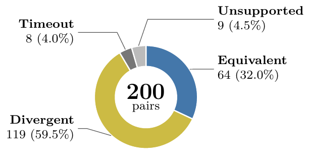
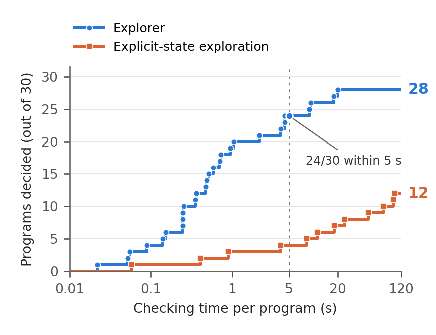

# Evaluation — PerCom working draft

상태: 2026-09-19 데이터셋 설명과 저자 작성·검토 사실을 반영. 중복되는 데이터셋 요약 표 D1은 삭제했다. E1은 범위 내 92건 전체 평가. E2는 구성을 본문으로 설명하고 판정 분포를 그림으로 제시한다. Counterexample은 수정에 필요한 행동 차이 정보로만 사용하며 대조군 비교나 인과적 개선 주장은 본문에 넣지 않는다. 근거·검증 메모는 `DRAFT_NOTES.md` 참조.

**Setup.** All code evaluations use JOI and the execution model in Sections V and VI. E1 evaluates expression and reference execution, E2 checks verdict fidelity, E3 evaluates generated candidates, and E4 measures completion and cost. Refusals, incomplete searches, and errors remain in each evaluation's denominator. LLM generation is separate from behavioral checking.

**Datasets.** We use 382 author-written commands from a test set created for the JOI platform to evaluate generated-code validation and repair (E3). The set varies automation type and structural complexity across 24 defined patterns, including conditional and event-triggered actions, sustained conditions, delayed sequences, schedules, and repetition. Its confirmed IRs contain two to eight operator nodes, with a maximum nesting depth of zero to three for branches and cycles. The dataset appendix reports the pattern breakdown and structural statistics.

We additionally collected 100 external automation requests to evaluate Timeline IR adequacy (E1). The following subsection describes their sources and behavioral characteristics.

## Timeline IR Adequacy

E1 evaluates whether Timeline IR can express automation requirements drawn from outside our own JOI test set. Relying only on author-written commands would limit the assessment to the patterns we had designed. We therefore collected 100 requests from official Google Home and Home Assistant examples~\cite{googlehomeexamples,haautomation}, published research tasks and examples~\cite{ur2014,huang2015,autotap,tapinspector,brackenbury2019}, released AutoTap participant responses~\cite{autotapdata}, and Home Assistant Community posts~\cite{hacommunity}. During collection, we sought complex requests combining timing requirements and multiple execution stages.

One author reviewed the collected requests for reactive-temporal scope, semantic duplicates, and unresolved behavioral choices. Of the 100 requests, 92 were in scope; six were classified as ambiguous because their source descriptions left execution time windows or conditions for acting or interrupting execution unclear. The remaining two concerned online-service integration, such as updating a Twitter profile picture when the Facebook profile picture changes, and were excluded from the evaluation scope of smart-home device behavior. The evaluated requests range from basic trigger–action rules to compound conditions and multiple device actions, sustained conditions, delayed sequences, repetition, and history-dependent execution. They also include response timeouts, cancellation or restart during execution, restoration of prior state, and independently progressing flows. These features can occur together within one request. For example, a request to blink a light repeatedly while a garage door is open, stop when it closes, and restore the original light setting combines repetition, cancellation, and state restoration.

We encoded and tested all 92 requests. Their final IRs contain three to eight distinct operator types per request, including `start_at` and `call`, with maximum branch/cycle nesting depths ranging from zero to four. These statistics describe the encodings, including monitoring loops used to detect events.

For each request, we recorded a concrete interpretation and expected actions and timestamps before encoding it. The author reviewed each interpretation and expected trace. We replayed the input histories on the reference IR runner and compared actions and timestamps, treating simultaneous actions as an unordered group. We report final encodings and retain failed attempts in the experiment records.

For all 92 evaluated requests, the final IR reproduced the expected actions and timestamps on every test input prepared for that request. This supports the IR's ability to express the requests under their specified interpretations and execution conditions and reproduce the expected behavior on the tested inputs. It does not establish correctness for all possible inputs or requests; Explorer support is evaluated separately.

## Validation Fidelity

To evaluate Explorer's verdicts, we assembled 200 IR–JOI code pairs. We used 20 requests from E1 to construct 150 pairs containing correct implementations and variants with one deliberately introduced fault. We added 50 valid generated candidates sampled from the 388-request development set. Faults span 12 families, including action omission, timing, guards, stored values, order, and repetition.

We checked whether Explorer's equivalence and divergence verdicts agreed with separate executions of each IR–JOI pair. For this comparison, we implemented a Timeline IR runner and a JOI interpreter from the language specifications without access to Explorer code.

We wrote scripts to generate test inputs from the IR conditions and durations and the existing E1 test histories. Each input history specifies sensor values and when they change. The scripts included values around condition thresholds and changes just before, at, and after waiting deadlines, without using Explorer's verdicts. We supplied each history to both reference implementations and compared the actions and their timestamps. We also executed the input histories returned by Explorer as counterexamples to check that they caused an actual difference.

For divergence, a concrete difference confirmed the counterexample for the tested device assignment. For equivalence, we checked that all supplied histories matched for an allowed device assignment; this provides evidence on the tested inputs, not a proof for all possible inputs. Each Explorer search used limits of 120 s, 400,000 states, and 2,000,000 transitions.

**Figure E2. Explorer outcomes on 200 IR–JOI code pairs.**

Timeout and unsupported cases remain undecided. None of the 183 equivalence or divergence verdicts contradicted the reference checks.

None of the 183 issued verdicts contradicted the reference checks (Figure E2). For all 119 pairs classified as divergent, the reference implementations confirmed a difference in actions or their timestamps. Among fault variants with an observed difference, Explorer left 11 undecided and accepted none. Of the 17 undecided pairs, 8 exceeded the time budget and 9 required arithmetic or input values outside the supported scope. Fault variants from the same request are related cases rather than independent samples.

## Generated-Code Validation

E3 checks LLM-generated JOI code against the supplied Timeline IR, then rechecks divergent candidates after one revision using counterexample feedback. We evaluated 382 smart-home commands from a dataset we constructed for the JOI hub. For each command, we supplied the confirmed IR and binding to Qwen3.5-9B to generate JOI code. The base checking budget was 20 s, scaled by the number of device assignments when several assignments had to be checked.

**Table E3. Outcomes on generated JOI candidates.**

| Outcome | Candidates | Share |
| --- | ---: | ---: |
| Equivalent | 309 | 80.89% |
| Divergent (replay-confirmed) | 68 | 17.80% |
| Unsupported | 3 | 0.79% |
| Inconclusive | 2 | 0.52% |
| Total | 382 | 100.00% |

Explorer issued a semantic verdict for 377 candidates (Table E3), a completion rate rather than an accuracy estimate. All 68 divergences were confirmed by its concrete replay. For example, one request turns off a power strip after 30 seconds without motion. The generated code counted one second as elapsed as soon as it first observed no motion, then added one each second. It therefore reached a count of 30 after only 29 seconds and turned off the strip. Explorer detected that the code acted one second earlier than required by the IR. The unsupported cases involved a binary return assignment, unbounded temperature arithmetic, and a large illuminance domain. Both inconclusive cases reached the time limit for an internal condition check. These exploratory results are relative to the confirmed IR and binding, not measurements of natural-language intent accuracy or physical-device behavior.

**Counterexamples for repair.** For each of the 68 divergent candidates, we supplied the same model with the counterexample input, the actions required by the IR, and the actions produced by the code, and requested one revision. We kept the IR and binding fixed. On rechecking, 36 candidates (52.9%) received an equivalence verdict and 26 remained divergent. The remaining cases comprised five checking timeouts and one repair generation failure due to a model context error.

## Validation Cost and Scale

E4 measures the time needed to complete behavioral checking as automation size and timing vary. We generated 30 equivalent IR–JOI pairs from one program template by varying the number of Boolean sensors (1–7), sequential wait–call stages (1–6), wait duration (100 ms–4 h), and repetitions (1–200), individually and in combination.

We compared Explorer with **explicit-state exploration**, which tracks concrete timer values in individual execution states. Explorer can instead represent sets of timer values together using constraints. Both methods use the same interpreters, advance to the next relevant event, and reuse identical states. Both require complete exploration to establish equivalence. Each program ran three times per method with a 120 s budget per run. Explorer ran serially, while the baseline used four concurrent workers on an eight-core host; the measurements therefore describe these execution settings rather than a speedup under equal load.

**Figure E4. Cumulative number of programs decided within each checking time.**

The time axis is logarithmic. A program counts as decided only if all three runs complete; its time is the slowest of the three. Undecided programs remain in the total of 30.

Explorer completed 28 of the 30 programs, compared with 12 for explicit-state exploration (Figure E4). It completed 24 within 5 s and all 28 within 21 s. Across the wait-duration sweep from 100 ms to 4 h, Explorer took 0.05–0.35 s. Its two unfinished programs combined six sensors, six stages, and 50 repetitions, or seven sensors, six stages, and 100 repetitions. Both reached the time limit. These results show the completion range and checking cost for the tested program family; costs for other program structures may differ.
