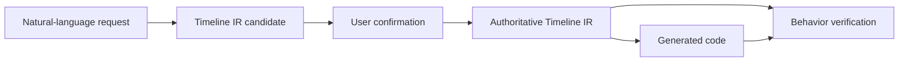
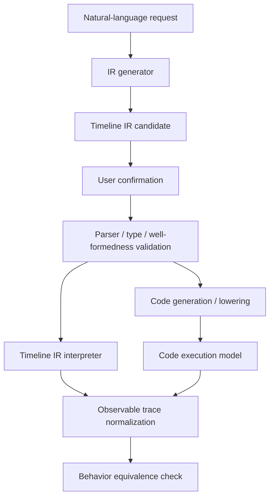

# OVLA: LLM 생성 IoT 자동화 코드의 행동 검증 논리 정리

> 작성 기준일: 2026-09-04  
> 문서 목적: LLM이 생성한 reactive-temporal IoT 자동화 코드를 행동 수준에서 검증한다는 문제를 중심에 두고, 그 검증을 성립시키기 위해 필요한 Timeline IR, 실행 의미론, compositionality, determinism 및 Explorer의 역할을 하나의 논리로 정리한다.

---

## 0. 핵심 결론

논문의 중심 문제는 Timeline IR 언어 자체가 아니라 **LLM이 생성한 IoT 자동화 코드를 어떻게 행동 수준에서 검증할 것인가**다. Timeline IR의 정의와 determinism 증명은 독립적인 언어 설계 목표가 아니라, 이 behavioral verification을 가능하게 하는 수단이다.

IoT 자동화 코드는 하나의 고정된 출력을 내는 프로그램이 아니라, 시간에 따라 들어오는 event와 state history에 대응하는 behavior를 정의하는 reactive-temporal program이다. 환경 입력이 달라지면 여러 action trace가 존재할 수 있다. 여기서 필요한 determinism은 코드나 IR이 모든 환경에서 하나의 고정된 trace만 만든다는 뜻이 아니라, **동일한 초기 상태와 동일한 timed input trace에 대해서는 유일한 action trace를 생성한다**는 뜻이다.

동일한 behavior는 previous/current comparison, flag variable 또는 state machine과 같이 서로 다른 code idiom으로 구현될 수 있다. 반대로 자연어와 표면적으로 비슷한 코드는 edge condition을 level condition으로 반복 실행하여 다른 trace를 만들 수 있다. 따라서 correctness는 syntax, AST 또는 문자열 유사도가 아니라 시간에 따라 전개되는 observable behavior로 판단해야 한다.

Behavior를 비교하려면 생성 코드가 보여야 하는 expected behavior를 산출하는 reference specification이 필요하다. 그러나 자연어는 trigger 종류, 시간 경계, timer 취소, state transition 및 동시 event 처리와 같은 의미를 암묵적으로 포함하며 직접 실행할 수 없다. Timeline IR은 이러한 behavior-bearing semantics를 제한된 typed operator로 끌어내어 명시적인 behavioral specification으로 만든다.

OVLA는 자연어로 표현된 사용자의 실제 의도와 생성 코드의 end-to-end 일치를 직접 보장하지 않는다. 자연어로부터 Timeline IR 후보를 생성하고 사용자가 이를 확인하면, 그 시점의 Timeline IR을 authoritative specification으로 간주한다. 이후 OVLA가 검증하는 것은 **확인된 Timeline IR과 생성 코드 사이의 행동적 동치**다.

Timeline IR이 검증 oracle이 되려면 동일한 초기 상태와 입력 trace에서 expected action trace를 직접 생성할 수 있어야 하므로 executable하고 input-deterministic해야 한다. 실제 자동화는 여러 trigger, timer, condition 및 state update의 조합이므로, 이 성질은 primitive에만 성립해서는 부족하며 composition 이후에도 보존돼야 한다.

논문의 중심 주장은 다음과 같이 정리할 수 있다.

> LLM-generated IoT automations are reactive-temporal programs whose behavior emerges from asynchronous events, persistent states, timers, and their execution history. Since behaviorally equivalent code may use different idioms while syntactically plausible code may produce a different action trace, correctness must be checked over behavior rather than source form. OVLA makes the implicit event-, state-, and time-dependent semantics of a natural-language request explicit through a user-confirmed Timeline IR. Its executable and compositionally deterministic semantics provide a unique reference action trace for each modeled input trace, enabling behavioral-equivalence verification of generated code.

이 주장의 보장 범위는 다음과 같다.

> 사용자에 의해 확인된 well-formed Timeline IR과 생성 코드는, 모델링된 환경과 명시된 탐색 범위 안의 모든 도달 가능한 입력에 대해 동일한 observable action trace를 생성한다.

이 주장은 다음을 보장하지 않는다.

- 자연어가 사용자의 실제 의도를 정확히 반영했는가
- LLM이 자연어에서 유일한 정답 해석을 찾았는가
- 임의의 사용자가 Timeline IR을 얼마나 쉽게 이해하는가
- 네트워크 장애나 물리 장치 고장까지 포함한 real-world correctness
- 배포 이후 오류 localization 및 자동 수정

---

## 1. 현재까지 확정된 연구 범위

### 1.1 사용자 확인을 검증 경계로 사용한다

자연어에서 생성된 Timeline IR은 처음에는 하나의 해석 후보다. 사용자가 해당 IR을 확인하면 이후부터 이를 정답 명세로 사용한다. 사용자 확인은 시스템이 자연어 의도를 올바르게 이해했다는 것을 자동으로 증명하는 절차가 아니다. 검증의 기준이 될 의미를 확정하는 절차다.

따라서 전체 파이프라인은 다음과 같이 나뉜다.

- 사용자 확인 이전: 자연어 해석과 authoring의 영역
- 사용자 확인 이후: 명세와 구현의 일치성을 검증하는 영역

### 1.2 Authoring phase는 유지하지만 정확성 검증의 대상에서는 제외한다

자연어에서 복잡한 reactive-temporal code를 직접 생성하는 대신 Timeline IR을 중간 단계로 제시하는 것은 여전히 중요한 contribution이다. Timeline IR은 자연어와 코드 사이의 semantic boundary를 형성하고, 자연어의 선택된 해석을 명시적인 명세로 바꾼다.

다만 OVLA는 다음을 검증하지 않는다.

- 자연어에서 Timeline IR로의 변환 정확도
- Timeline IR이 실제 사용자의 잠재 의도와 일치하는지
- 사용자가 confirmation 과정에서 올바르게 판단했는지

논문에서는 authoring contribution과 verification guarantee를 분리해서 서술해야 한다.

- **Authoring contribution:** 자연어 요청을 구조화된 Timeline IR 후보로 변환한다.
- **Assumption:** 의도된 사용자는 생성된 Timeline IR을 검토하고 확인할 수 있다.
- **Verification guarantee:** 확인된 Timeline IR과 생성 코드의 행동적 동치를 검사한다.

### 1.3 Readability는 평가 대상에서 제외한다

Timeline IR의 문법과 구조는 사람이 관계를 파악할 수 있는 형태로 설명할 수 있지만, OVLA는 readability 또는 usability를 독립된 검증 주장으로 삼지 않는다. 따라서 Rendering Faithfulness나 사용자 이해도 실험은 핵심 평가에서 제외한다.

`human-readable`이라는 강한 표현보다는 다음과 같은 표현이 안전하다.

- structured
- explicit
- inspectable
- formally defined

논문에서 비전문가 전체를 대상으로 이해 가능성을 주장하기보다는, 의도된 사용자가 Timeline IR을 확인할 수 있다는 사용 가정을 명시한다.

### 1.4 오류 localization과 배포 후 수정은 범위 밖이다

확인된 Timeline IR과 코드가 모델 안에서 동치라면, OVLA가 목표로 삼은 implementation correctness는 만족된 것이다. 이후 실제 결과가 만족스럽지 않은 경우에는 사용자 확인, 환경 모델, 외부 장치 동작 또는 검증기 구현 등의 가정 중 하나가 어긋난 것이다. OVLA는 이를 진단하거나 자동 수정하는 시스템을 주장하지 않는다.

---

## 2. 문제 정의: reactive-temporal code는 behavior로 검증해야 한다

LLM 기반 IoT 자동화 생성은 단순한 NL→command 변환 문제가 아니다. 생성되는 대상은 비동기 event에 반응하고, sensor state와 persistent variable을 유지하며, timer와 반복 실행을 통해 시간에 걸쳐 행동하는 reactive-temporal program이다. 따라서 correctness는 한 시점의 출력이 아니라 입력과 실행 history에 따라 전개되는 action trace 전체에 대해 정의해야 한다.

이때 “IoT 코드가 결정론적인 결과를 내지 않는다”고 표현해서는 안 된다. 환경 입력에 따라 가능한 trace가 여러 개라는 사실과, 동일한 입력 trace에서 여러 결과가 나오는 program nondeterminism은 서로 다르다. OVLA에서 다루는 기본 모델은 환경은 여러 입력 history를 제공할 수 있지만, 고정된 초기 상태와 입력 history 아래의 프로그램 행동은 비교 가능한 하나의 trace로 관찰된다는 것이다.

Reactive-temporal IoT automation은 단순한 trigger–action 연결을 넘어 다음과 같은 요소를 포함한다.

- 시간 구간과 경계 시각
- 특정 상태가 일정 시간 지속되는 조건
- 내부 변수와 device state
- timer 생성, 만료 및 취소
- 여러 event의 동시 발생
- 여러 rule 사이의 상호작용
- 동일 actuator에 대한 충돌하는 action
- 실행 도중 trigger가 다시 발생하는 reentry

자연어에서는 이러한 의미가 생략되거나 여러 방식으로 해석될 수 있다. 예를 들어 “10분 동안 사람이 없으면 조명을 끄고 사람이 다시 들어오면 켜라”라는 요청만으로는 다음이 명확하지 않을 수 있다.

- absence timer가 정확히 언제 시작되는가
- 중간에 순간적으로 사람이 감지되면 timer가 취소되는가
- 정확히 10분이 되는 순간 motion event가 들어오면 어떤 event가 먼저 처리되는가
- 조명을 끄는 action과 켜는 action이 같은 시각에 발생하면 무엇을 우선하는가

반면 생성 코드는 이러한 결정을 구체적인 event handler, variable, callback, timer 및 실행 순서로 구현한다. 따라서 자연어에서 코드로 바로 이동하면 두 가지 오류 가능성이 섞인다.

1. **Interpretation mismatch:** 자연어를 다른 의미로 해석했다.
2. **Implementation mismatch:** 선택한 의미는 맞지만 코드가 이를 잘못 구현했다.

동일한 behavior가 여러 code idiom으로 구현될 수 있고, 표면적으로 유사한 코드가 다른 trace를 만들 수 있으므로 syntax, AST 및 문자열 유사도는 correctness oracle이 될 수 없다. LLM judge 역시 source form에 의존하지 않는 명확한 behavioral reference를 대신하지 못한다. 자연어는 여러 해석을 허용하고 직접 실행할 수 없기 때문에 생성 코드의 expected behavior를 산출하는 oracle로 사용할 수 없으며, 코드 자체도 검증 대상이므로 자기 자신을 oracle로 사용할 수 없다.

기존 논문의 Figure 1은 이 motivation을 유지하는 중심 예시다. Previous/current comparison과 triggered flag는 형태가 다르지만 같은 rising-edge trace를 만들고, 자연어와 가장 비슷해 보이는 level-condition 구현은 조건이 유지되는 동안 action을 반복하여 다른 trace를 만든다. 이 예시는 “다른 코드가 동일하게 행동할 수 있고, 비슷한 코드가 다르게 행동할 수 있다”는 문제를 먼저 보여준 뒤 behavioral comparison의 필요성을 도출하는 데 사용한다.

OVLA는 이 문제를 자연어에서 선택된 해석을 Timeline IR에 고정하고, 사용자가 확인한 Timeline IR을 실행 가능한 reference specification으로 사용하는 방식으로 해결한다. 이를 통해 자연어 해석 문제와 구현 정확성 문제를 명시적으로 분리한다.

---

## 3. Timeline IR이 필요한 이유

Timeline IR의 필요성은 readability가 아니라 다음 네 단계의 논리에서 나온다.

1. 자연어는 행동을 검증하기 위한 정밀한 oracle이 될 수 없다.
2. 코드와 비교하려면 특정 입력에서 기대되는 행동을 생성할 수 있는 명세가 필요하다.
3. 사용자 확인을 거친 Timeline IR이 그 명세 역할을 수행한다.
4. Timeline IR이 executable하고 deterministic해야 코드와 동일한 입력에서 결과를 직접 비교할 수 있다.

따라서 Timeline IR은 다음 세 역할을 동시에 수행한다.

### 3.1 Semantic normalization target

자연어의 선택된 해석을 trigger, condition, temporal constraint, state update, action과 같은 제한된 의미 단위로 정규화한다.

### 3.2 Authoritative specification

사용자 확인 이후 Timeline IR은 코드 생성 및 검증의 기준이 된다. 이 시점 이후에는 자연어가 아니라 Timeline IR이 authoritative specification이다.

### 3.3 Executable behavioral oracle

동일한 초기 상태와 외부 입력 시퀀스를 받아 기대되는 state transition과 action trace를 생성한다. 이 실행 결과를 생성 코드의 행동과 비교할 수 있다.

---

## 4. 혼동하기 쉬운 세 가지 개념

### 4.1 NL→IR 생성의 결정성

동일한 자연어를 입력했을 때 항상 동일한 IR이 생성되는지를 뜻한다. OVLA에서 이 성질은 요구되지 않는다. 자연어는 본질적으로 여러 해석을 허용할 수 있고, LLM도 여러 후보를 생성할 수 있다.

따라서 다음과 같은 주장은 피해야 한다.

> Timeline IR deterministically maps natural language to one meaning.

선택된 후보를 최종 명세로 만드는 것은 사용자 confirmation까지 포함한 authoring 과정이다.

### 4.2 Semantic unambiguity

하나의 유효한 Timeline IR이 무엇을 의미하는지가 형식적으로 하나로 정의되는 성질이다. 이는 Timeline IR에 반드시 필요하다.

정확한 표현은 다음과 같다.

> Timeline IR makes a selected interpretation of an ambiguous natural-language request explicit.

서로 다른 Timeline IR 프로그램이 동일한 behavior를 표현할 수는 있다. 즉, semantic unambiguity가 syntactic canonicality를 의미하지는 않는다.

### 4.3 Operational 또는 input determinism

동일한 Timeline IR, 초기 상태 및 timed external-input trace가 주어졌을 때 유일한 observable behavior가 생성되는 성질이다.

하나의 IR 프로그램이 모든 상황에서 항상 같은 action을 수행한다는 뜻은 아니다. 센서 입력이 달라지면 행동도 달라질 수 있다. 정확한 의미는 다음 함수 관계다.

\[
(T,s_0,I)\longmapsto A
\]

- \(T\): Timeline IR 프로그램
- \(s_0\): 초기 configuration
- \(I\): timed external-input trace
- \(A\): observable action trace

Operational determinism은 다음과 같이 표현한다.

\[
|\mathrm{Beh}(T,s_0,I)|=1
\]

### 4.4 Ambiguity와 nondeterminism의 차이

형식 명세는 의미가 명확하면서도 nondeterministic할 수 있다. 예를 들어 “온도를 23도 또는 24도로 설정한다”를 `{23, 24}` 중 하나를 허용하는 명세로 정확히 정의할 수 있다. 의미는 명확하지만 허용 행동이 두 개다.

- **Ambiguity:** 명세가 무엇을 뜻하는지 해석자마다 달라진다.
- **Nondeterminism:** 의미는 명확하지만 동일 입력에서 여러 행동을 허용한다.
- **Underspecification:** 특정 입력 상황의 행동을 정의하지 않는다.

OVLA에서 semantic unambiguity는 자연어를 명세로 바꾸기 위해 필요하고, operational determinism과 totality는 그 명세를 코드 검증 oracle로 사용하기 위해 필요하다.

---

## 5. Timeline IR의 핵심 설계 요구사항

이 절의 각 성질은 Timeline IR을 독립적인 formal language로 완성하기 위해 임의로 추가하는 것이 아니다. 모두 생성 코드의 behavioral verification에 필요한 reference oracle을 구성한다는 요구에서 도출된다.

### 5.1 Expressive adequacy

Timeline IR은 지원 대상으로 명시한 reactive-temporal automation의 의미 공간을 표현할 수 있어야 한다. 여기서 coverage는 모든 자연어나 모든 IoT 프로그램을 의미하지 않는다.

목표 의미 공간은 최소한 다음 차원을 명시해야 한다.

- event 및 state-based trigger
- boolean 및 비교 condition
- 시간 구간과 duration
- timer 생성·취소·만료
- state variable의 read 및 update
- action과 parameter
- sequence, conditional 및 동시 rule
- 반복 실행 및 reentry

Coverage를 주장하려면 먼저 이 target behavior space를 형식적으로 한정해야 한다.

### 5.2 Formal syntax and well-formedness

어떤 프로그램이 유효한 Timeline IR인지 문법, 타입 및 정적 규칙으로 판단할 수 있어야 한다. 확인이 끝난 IR에는 최소한 다음이 없어야 한다.

- 해결되지 않은 parameter 또는 reference
- type error
- 정의되지 않은 timer
- 의미가 없는 시간 값
- 처리 규칙이 없는 action conflict
- 정책이 정의되지 않은 reentry
- 종료되지 않는 zero-time cycle

### 5.3 Semantically unambiguous

각 syntax construct의 의미를 operational semantics 또는 denotational semantics로 정의해야 한다. Parser가 하나의 AST를 생성하는 것만으로는 충분하지 않다. AST가 어떤 state transition과 action을 의미하는지도 유일해야 한다.

### 5.4 Executable semantics

자연어 자체는 검증에 필요한 reference trace를 생성할 수 없으므로 Timeline IR은 executable해야 한다. Timeline IR interpreter는 다음을 계산할 수 있어야 한다.

\[
Run_{IR}(T,s_0,I)=A_T
\]

Executable하다는 것은 Timeline IR을 실제 IoT 플랫폼에 직접 배포한다는 뜻이 아니다. 명세의 의미를 기계적으로 실행하여 state transition과 action trace를 생성할 수 있다는 뜻이다.

### 5.5 Input-total observational determinism

Verifier가 하나의 입력 scenario에 대해 명확한 expected action을 가져야 하므로, 모든 유효한 초기 상태와 입력에 대해 정확히 하나의 다음 transition이 존재해야 한다. 수행할 action이 없는 경우에도 `no-op` 또는 `stutter`를 명시한다.

결정론성의 관찰 단위는 내부 instruction 순서가 아니라 외부에서 의미 있는 behavior여야 한다. 독립적인 두 action의 런타임 실행 순서가 달라도 동일 timestamp의 동일 action batch라면 같은 behavior로 간주할 수 있다. 이를 observational determinism이라고 한다.

### 5.6 Compositional semantics

실제 자동화는 여러 trigger, timer, condition 및 state update를 결합하므로 primitive의 determinism만으로는 충분하지 않다. 복합 operator의 의미가 constituent operator들의 의미와 composition rule만으로 계산돼야 한다.

\[
\llbracket Op(P,Q)\rrbracket
=F_{Op}(\llbracket P\rrbracket,\llbracket Q\rrbracket)
\]

Compositionality와 global determinism은 동일한 성질이 아니다. Timeline IR에서 필요한 추가 성질은 deterministic한 하위 프로그램들을 well-formed하게 조합했을 때 전체 프로그램도 deterministic하다는 것이다.

### 5.7 Explicit temporal and concurrency semantics

시간 경계, 동시 event, parallel action 및 conflict의 의미가 언어 차원에서 정의돼야 한다. 실행기 내부의 우연한 scheduling이나 source-code 선언 순서가 의미를 결정해서는 안 된다.

### 5.8 Analyzability

Behavioral divergence는 특정 event·state·time history 이후에만 나타날 수 있으므로 단일 입력이나 개별 test case만으로는 충분하지 않다. Explorer가 프로그램의 configuration과 transition을 기계적으로 생성할 수 있어야 한다. 변수, timer 및 control state가 명시적으로 표현돼야 하며, 유한한 환경 모델 또는 sound abstraction 안에서 reachable state space를 탐색할 수 있어야 한다.

### 5.9 Semantics-preserving lowerability

Timeline IR은 대상 플랫폼 코드로 변환할 수 있어야 한다. 중요한 것은 코드 구조가 IR과 비슷한지가 아니라 동일한 외부 입력에 대해 관찰 가능한 행동이 같은지다.

---

## 6. Executable Timeline IR과 Code Equivalence

Executability와 behavioral equivalence는 구분해야 한다.

### 6.1 Executability는 Timeline IR 언어의 속성이다

Timeline IR의 reference interpreter는 다음을 실행한다.

\[
Run_{IR}(T,s_0,I)=A_T
\]

### 6.2 Equivalence는 IR과 코드 사이의 관계다

생성 코드도 같은 초기 상태와 외부 입력 trace를 받아 실행된다.

\[
Run_{Code}(C,s_0,I)=A_C
\]

두 실행의 관찰 결과가 모든 도달 가능한 입력에서 같아야 한다.

\[
\forall I\in\mathcal{R},\quad
Obs(A_T)=Obs(A_C)
\]

여기서 \(\mathcal{R}\)은 모델링된 환경 안에서 도달 가능한 timed input space다.

동일하게 제공해야 하는 것은 전체 내부 state sequence가 아니라 다음 두 가지다.

- 동일한 initial state 또는 initial environment configuration
- 동일한 timed exogenous-input trace

내부 state sequence는 각 프로그램 실행의 결과다. 이를 미리 같다고 가정하면 잘못된 state update를 가릴 수 있다.

`Obs`가 무엇을 포함하는지도 정의해야 한다. 기본적으로 다음을 고려할 수 있다.

- action timestamp
- target device 또는 service
- operation type
- action parameter
- 동일 시각 내 명시적 causal order

코드와 IR의 내부 변수 이름이나 control structure는 달라도 된다. Observable action trace가 동일하면 behaviorally equivalent하다.

---

## 7. 권장 실행 의미론: Snapshot–Evaluate–Merge–Commit

> 상태: 현재까지 논의된 구체 설계안. 실제 Timeline IR 문법 및 런타임에 맞춰 확정해야 한다.

복수의 rule과 timer가 존재하는 reactive program을 deterministic하게 실행하려면 한 logical time의 실행을 명시적인 단계로 분리하는 것이 좋다.

### 7.1 Configuration

실행 configuration은 다음과 같이 정의할 수 있다.

\[
C=\langle P,\sigma,\Theta,t\rangle
\]

- \(P\): 현재 residual program 또는 활성 rule instance
- \(\sigma\): IR variable과 모델링된 device state
- \(\Theta\): 활성 timer 상태
- \(t\): logical time

동일 timestamp의 외부 event들을 \(E_t\), 해당 시점의 observable action을 \(A_t\)라 하면 한 번의 reaction은 다음과 같다.

\[
C\xrightarrow{E_t/A_t}C'
\]

### 7.2 실행 단계

1. **Snapshot:** 시각 \(t\)의 sensor event와 timer expiration을 canonical event batch로 구성하고 pre-state를 고정한다.
2. **Evaluate:** 모든 활성 rule은 동일한 pre-state를 읽고 state를 즉시 변경하는 대신 effect를 생성한다.
3. **Merge:** 생성된 effect를 deterministic merge function으로 병합한다.
4. **Commit:** 병합된 effect를 원자적으로 적용하여 다음 configuration과 action batch를 생성한다.

\[
eval(P_i,\sigma,\Theta,E_t)=(P_i',\Delta_i)
\]

\[
merge(\Delta_1,\ldots,\Delta_n)=\Delta
\]

\[
commit(C,\Delta)=(C',A_t)
\]

이 구조를 사용하면 rule 평가 순서나 실제 runtime thread scheduling에 따라 결과가 달라지는 것을 막을 수 있다.

### 7.3 Action과 effect의 표현

병렬 action을 단순한 source-code 순서가 아니라 canonical action batch로 나타낸다. 단순 set은 동일 action의 중복 발생을 제거할 수 있으므로, 정확한 의미에 따라 다음 중 하나를 선택해야 한다.

- canonical multiset
- target별 typed effect map
- causal order를 포함한 partial-order event structure

명시적인 `sequence`가 생성한 causal order는 보존하고, 독립적인 parallel action의 우연한 평가 순서는 관찰에서 제거한다.

### 7.4 Conflict 처리

예를 들어 같은 시각에 다음 effect가 생성될 수 있다.

\[
\{\mathrm{light.on},\mathrm{light.off}\}
\]

각 action은 독립적으로 deterministic하지만 전체 프로그램의 결과는 충돌한다. 가능한 정책은 다음과 같다.

1. 잠재 충돌을 정적으로 거부한다.
2. 명시적인 priority 또는 resolution operator가 있을 때만 허용한다.
3. 의미론에서는 `Conflict`라는 유일한 결과를 생성하고, confirmed specification이 되기 전에 수정하도록 한다.

언어의 보장과 사용자의 의도 명시를 함께 고려하면, 충돌을 source declaration order로 조용히 해결하는 방식보다 1과 2를 결합하는 것이 적절하다. 다만 정적 conflict checker가 모든 충돌을 막는다고 주장하려면 checker의 soundness도 뒷받침해야 한다.

### 7.5 시간 및 reentry 규칙

다음 정책은 명시적으로 정해야 한다.

- 같은 시각의 external event와 timer expiration을 하나의 batch로 볼 것인가
- timer expiration과 cancellation이 동시에 발생하면 무엇을 우선하는가
- 시간 구간의 시작과 끝이 inclusive인가
- event가 들어온 상태를 guard 평가 전에 반영하는가
- 실행 중 동일 trigger가 다시 발생하면 ignore, restart, queue 중 무엇을 적용하는가
- action으로 유도된 event를 같은 logical tick에서 처리하는가

같은 tick 안에서 derived event를 계속 처리하면 fixpoint의 존재, 유일성 및 종료성을 증명해야 한다. 더 단순한 설계는 derived event를 다음 logical step으로 넘기고 zero-time recursive cycle을 금지하는 것이다.

---

## 8. Compositionality와 Global Determinism

### 8.1 Compositionality의 정확한 의미

Compositionality는 전체 프로그램의 의미가 하위 프로그램의 의미와 해당 composition operator만으로 계산된다는 뜻이다.

예를 들어 `Seq(P,Q)`, `If(c,P,Q)`, `Parallel(P,Q)`의 의미는 각각 \(P\), \(Q\), \(c\)의 의미와 해당 조합 규칙으로 정의돼야 한다. 외부의 숨겨진 scheduler state나 source-code 순서가 의미를 바꾸면 compositional하지 않다.

### 8.2 Local determinism은 global determinism을 자동으로 보장하지 않는다

다음 두 rule을 생각할 수 있다.

- \(P\): motion event가 발생하면 `light.on`
- \(Q\): absence timer가 만료되면 `light.off`

같은 시각에 두 event가 발생하면 각 rule은 개별적으로 유일한 action을 생성하지만 전체 effect는 충돌한다. 따라서 primitive determinism만으로는 충분하지 않고 composition operator가 determinism을 보존하는지 보여야 한다.

### 8.3 Determinism-preserving composition

각 composition operator \(O\)에 대해 다음 성질을 보여야 한다.

\[
\bigwedge_i Det(P_i)\land WF_O(P_1,\ldots,P_n)
\Rightarrow
Det(O(P_1,\ldots,P_n))
\]

즉, 하위 프로그램이 deterministic하고 조합이 well-formed라면 전체 프로그램도 deterministic해야 한다.

Parallel composition의 경우 허용된 effect에 대해 merge operator가 평가 순서와 무관해야 한다.

\[
\Delta_1\oplus\Delta_2
=
\Delta_2\oplus\Delta_1
\]

\[
(\Delta_1\oplus\Delta_2)\oplus\Delta_3
=
\Delta_1\oplus(\Delta_2\oplus\Delta_3)
\]

즉, merge가 commutative하고 associative해야 한다. 충돌하거나 순서가 의미 있는 effect에는 별도의 명시적 규칙을 적용해야 한다.

---

## 9. Global Determinism을 어떻게 증명할 것인가

이 증명의 목적은 Timeline IR이라는 언어 자체의 형식적 완결성을 전면에 내세우는 것이 아니다. 복잡한 IoT 자동화에서도 IR이 각 input trace에 대해 하나의 reference behavior를 제공하고, 그 결과 생성 코드에 명확한 pass/fail verdict를 내릴 수 있음을 뒷받침하는 것이 목적이다.

언어 전체의 determinism은 실험으로 증명할 수 없다. Timeline IR의 syntax와 semantics를 형식적으로 정의하고, 모든 well-formed program에 대해 구조적 귀납법으로 증명해야 한다.

### 9.1 Formal transition relation

한 step의 실행을 다음과 같이 정의한다.

\[
C\xrightarrow{E/A}C'
\]

Determinism theorem은 다음과 같다.

\[
C\xrightarrow{E/A_1}C_1
\land
C\xrightarrow{E/A_2}C_2
\Rightarrow
A_1=A_2\land C_1=C_2
\]

Totality까지 포함하면 다음처럼 쓸 수 있다.

\[
WF(P,C)\Rightarrow
\exists!(C',A).\;C\xrightarrow[P]{E/A}C'
\]

즉, 모든 well-formed program은 동일한 configuration과 event batch에 대해 정확히 하나의 다음 configuration과 observable action을 가진다.

### 9.2 필요한 lemma

#### Lemma 1: Expression totality and determinism

모든 well-typed expression은 하나의 값을 가져야 한다.

\[
\sigma\vdash e\Downarrow v_1
\land
\sigma\vdash e\Downarrow v_2
\Rightarrow v_1=v_2
\]

Missing 또는 unknown 값을 허용한다면 이를 별도 값으로 취급하고 평가 결과를 정의해야 한다.

#### Lemma 2: Primitive determinism

Action, assignment, timer creation 및 cancellation 등 각 primitive가 동일한 configuration과 input에서 유일한 effect를 생성함을 보인다.

#### Lemma 3: Merge determinism and permutation invariance

Compatible effect collection의 merge 결과가 유일하며, branch를 나열한 순서에 의존하지 않음을 보인다.

#### Lemma 4: Determinism preservation by constructors

각 composition operator가 determinism을 보존함을 보인다.

- `If`: total condition이 하나의 branch만 선택한다.
- `Seq`: 선행 operator의 완료 여부와 다음 실행 위치가 유일하다.
- `Parallel`: 각 branch의 effect와 merge 결과가 유일하다.
- Temporal operator: deadline 계산, boundary 및 tie rule이 유일하다.
- Repeat/retrigger: instance 생성, 취소 및 종료 정책이 유일하다.

#### Lemma 5: Preservation

Well-formed configuration에서 transition한 다음 configuration도 well-formed임을 보인다.

#### Lemma 6: Progress 또는 totality

모든 valid input에서 다음 transition이 존재함을 보인다. Action이 없으면 stutter transition을 생성한다.

#### Lemma 7: Reaction termination

한 logical time 안의 microstep 처리가 유한 시간 안에 끝남을 보인다. Deterministic하더라도 zero-time loop에 빠지면 executable oracle로 사용할 수 없다.

### 9.3 증명 구조

1. Primitive operator에 대해 totality와 determinism을 보인다.
2. 각 syntax constructor가 determinism을 보존함을 보인다.
3. 프로그램 AST에 대한 structural induction으로 one-step determinism을 증명한다.
4. Input trace의 길이에 대한 귀납으로 unique trace property를 얻는다.

최종 정리는 다음과 같다.

> For every well-formed Timeline IR program, under the defined temporal, event-ordering, and conflict-resolution semantics, an initial configuration and a timed external-input trace induce a unique observable action trace.

### 9.4 Compositionality를 별도 정리로 강화하는 방법

Compositional semantics는 복합 operator의 의미를 subprogram들의 의미로 정의함으로써 제시할 수 있다. 이를 별도 정리로 강화하려면 contextual congruence를 보일 수 있다.

\[
P\equiv Q
\Rightarrow
K[P]\equiv K[Q]
\]

즉, behavior가 같은 subprogram을 어떤 Timeline IR context 안에서 교체해도 전체 behavior가 달라지지 않는다. 다만 OVLA의 핵심 검증 논리에는 contextual congruence보다 constructor별 determinism-preservation theorem이 더 직접적으로 중요하다.

---

## 10. 증명 요구가 Timeline IR 설계에 미치는 영향

Determinism proof를 나중에 기존 언어 위에 덧붙이는 방식으로는 부족하다. 증명 가능성이 Timeline IR의 구조를 결정해야 한다.

| 증명해야 하는 성질 | 필요한 Timeline IR 설계 |
|---|---|
| Primitive determinism | 제한된 primitive와 pure·total expression |
| 숨겨진 입력 제거 | 시간, 센서값, 장치 응답을 external input으로 표현 |
| Sequence determinism | 명시적인 control position 또는 residual program |
| Parallel order independence | 동일 snapshot에서 평가하고 effect를 이후에 병합 |
| Merge uniqueness | typed effect와 명시적인 conflict rule |
| Temporal determinism | timer boundary와 event-processing phase 고정 |
| Reentry determinism | ignore, restart, queue 등의 정책 명시 |
| Reaction termination | zero-time cycle 금지 또는 종료 가능한 microstep semantics |
| Structural proof 가능성 | arbitrary host-language code를 제외한 닫힌 AST/operator 구조 |

권장되는 semantic core의 계층은 다음과 같다.

1. **Pure expression layer:** boolean 및 arithmetic expression, state read
2. **Primitive effect layer:** action, state update, timer update
3. **Composition layer:** sequence, conditional, parallel, temporal composition
4. **Reaction layer:** event batching, rule activation, effect merging, commit
5. **Observation layer:** backend-independent timed action trace

각 operator가 state를 임의 순서로 즉시 변경하기보다 명시적인 effect를 반환하도록 만들면, composition rule을 하나의 함수로 정의할 수 있고 global determinism 증명이 단순해진다.

---

## 11. Explorer와 Determinism의 관계

생성 코드의 오류는 특정 event, state 및 time history를 거친 뒤에만 나타날 수 있으므로 한두 개의 대표 입력 trace만 비교해서는 behavioral equivalence를 판단할 수 없다. Explorer는 모델링된 환경에서 가능한 history와 reachable configuration을 체계적으로 탐색하기 위해 필요하다.

Timeline IR 프로그램이 input-deterministic하더라도 환경 입력에는 여러 가능성이 있으므로 Explorer가 생성하는 graph는 branching할 수 있다.

> The environment is nondeterministic, while the Timeline IR program is input-deterministic.

하나의 graph state에서 서로 다른 sensor input에 따라 여러 successor가 생기는 것은 정상이다. Determinism이 요구하는 것은 **같은 state와 같은 input label에서 서로 다른 결과가 나오지 않는 것**이다.

Graph 관점에서는 다음과 같이 표현할 수 있다.

\[
\forall q,e,\quad
|\{(a,q')\mid q\xrightarrow{e/a}q'\}|\le 1
\]

State 수가 지수적으로 증가하는 것은 determinism 실패가 아니라 Explorer의 scalability 문제다. `exhaustive`라는 표현을 사용하려면 다음 조건이 필요하다.

- state와 input domain이 유한하게 정의돼 있음
- 시간 abstraction 또는 exploration horizon이 명시돼 있음
- 탐색이 reachable-state fixpoint까지 완료됐거나 bound가 명시돼 있음
- state merging 또는 abstraction을 사용한다면 soundness가 뒷받침됨

실제 탐색이 bounded라면 `all possible real-world behaviors`가 아니라 다음과 같이 표현해야 한다.

> Explorer exhaustively enumerates all reachable behaviors within the finite environment model and specified exploration bounds.

---

## 12. 논문의 증명과 실험을 어떻게 나눌 것인가

언어 차원의 determinism과 실제 interpreter의 correctness는 서로 다른 주장이다.

| 방법 | 뒷받침하는 주장 | 한계 |
|---|---|---|
| 수학적 또는 기계 검증된 proof | 모든 well-formed IR의 의미론적 determinism | 구현된 interpreter가 의미론을 정확히 구현했는지는 별도 |
| Property-based testing | 다양한 생성 사례에서 interpreter가 요구 속성을 지키는지 | 언어 전체를 증명하지 못함 |
| Bounded exhaustive testing | 지정된 작은 상태·시간 공간의 successor uniqueness | arbitrary size 또는 unbounded execution을 증명하지 못함 |
| Differential conformance testing | 실제 interpreter와 독립 reference evaluator의 결과 일치 | reference semantics 자체의 타당성은 proof에 의존 |
| Scalability experiment | Explorer의 시간·메모리 및 state-space 증가 | semantic determinism을 증명하지 않음 |

### 12.1 논문에 필요한 최소 formal evidence

- Timeline IR의 formal grammar
- type 및 well-formedness rule
- 각 operator의 operational semantics
- primitive determinism lemma
- effect merge lemma
- constructor별 determinism-preservation lemma
- global determinism theorem과 proof sketch
- 전체 규칙과 구조적 귀납 증명은 appendix에 수록

작은 semantic core를 Lean, Coq 또는 Isabelle로 기계 검증할 수 있다면 강한 근거가 되지만, 시스템 논문에서 반드시 필요한 것은 아니다. 명확한 의미론과 paper proof가 먼저다.

### 12.2 Interpreter conformance를 위한 구현 실험

- 무작위 well-formed AST, state 및 event batch를 생성하는 property-based testing
- parallel rule의 평가 순서를 바꿔도 normalized action trace가 같은지 확인하는 permutation testing
- merge의 associativity, commutativity 및 identity를 검사하는 algebraic test
- timer 동시 만료, event–timer tie, retrigger, missing sensor 및 conflict의 boundary-case suite
- 작은 finite model에서 모든 configuration과 input을 열거하여 successor uniqueness 검사
- 가능하다면 독립된 reference evaluator와 production interpreter의 differential testing

Explorer와 동일한 interpreter가 graph를 생성한 뒤 그 graph가 deterministic하다고 검사하는 것만으로는 근거가 순환적일 수 있다. Formal semantics에서 직접 도출한 test oracle 또는 독립된 reference evaluator를 두는 것이 좋다.

### 12.3 Coverage 및 expressiveness 평가

Coverage는 determinism과 별개의 평가 축이다. 먼저 target behavior space를 정의한 뒤 다음을 평가할 수 있다.

- target automation construct가 Timeline IR primitive로 표현되는지
- 실제 또는 benchmark automation이 의미 손실 없이 표현되는 비율
- temporal, stateful, concurrent feature 조합에 대한 construct coverage
- 지원하지 않는 behavior와 그 이유

`모든 자연어 자동화 표현 가능`이라는 주장은 피하고, `supported reactive-temporal automation model`에 대한 expressive adequacy로 한정한다.

### 12.4 Explorer scalability 평가

State variable, sensor domain, timer 및 concurrent rule의 수를 증가시키면서 다음을 측정할 수 있다.

- reachable state 수
- transition 수
- exploration time
- peak memory
- completion 또는 timeout 비율

이 실험은 상태 조합의 증가가 exponential할 수 있음을 정직하게 보여주고, 논문에서 exhaustive guarantee가 적용되는 실질적 범위를 설명하는 역할을 한다.

---

## 13. OVLA 시스템 구조

논리적으로 필요한 시스템 구성요소는 다음과 같다.

### 13.1 IR generator

자연어를 Timeline IR 후보로 생성한다. 이 단계는 authoring contribution이지만 자연어 의도 정확성은 OVLA의 verification guarantee에 포함되지 않는다.

### 13.2 Parser 및 well-formedness validator

생성된 IR이 문법, 타입, 시간 규칙, reference 및 conflict 규칙을 만족하는지 검사한다. 이는 자연어 의도를 검증하는 것이 아니라 IR이 형식 명세로 성립하는지 검사하는 것이다.

### 13.3 Timeline IR interpreter

Formal operational semantics를 구현하고 각 초기 상태와 외부 입력에서 reference transition 및 action trace를 생성한다.

### 13.4 Code generation 또는 lowering

확인된 IR을 대상 IoT 코드로 변환한다. 생성 방식이 deterministic compiler이든 LLM-assisted lowering이든, 최종 보장은 구현 방식이 아니라 behavior comparison을 통해 얻는다.

### 13.5 Code execution model

실제 장치 대신 동일한 environment model과 input trace 아래에서 코드를 실행한다. Platform-specific action을 IR의 observation vocabulary로 변환할 adapter가 필요하다.

### 13.6 Behavior equivalence checker

IR과 코드의 normalized observable trace 또는 reachable behavior graph를 비교한다. 비교 대상은 source-code 구조가 아니라 action target, operation, parameter, timing 및 명시적 causal order다.

---

## 14. 이 시스템을 사용함으로써 얻는 이점

### 14.1 의도 해석과 구현 정확성을 분리한다

사용자 확인 이전의 의미 선택과 이후의 코드 구현 검증이 분리된다. 따라서 OVLA가 무엇을 보장하고 무엇을 가정하는지 명확해진다.

### 14.2 실행 가능한 기준 행동을 제공한다

Confirmed Timeline IR은 동일한 입력에서 유일한 expected action trace를 생성한다. 자연어를 직접 oracle로 사용하는 문제를 피한다.

### 14.3 코드의 형태가 아니라 semantics를 검증한다

코드의 변수 이름, 함수 구조 및 구현 스타일이 달라도 observable behavior가 같으면 통과할 수 있다. 반대로 syntax가 정상이어도 action이나 timing이 다르면 동치가 아니다.

### 14.4 복합 temporal behavior를 체계적으로 탐색한다

Timer, state variable 및 여러 sensor event가 결합된 상황을 reachable-state exploration의 대상으로 만들 수 있다. 사람이 개별 test case를 임의로 선택하는 것보다 모델 범위 안에서 체계적인 검증이 가능하다.

### 14.5 언어 차원의 명확한 보장을 제공한다

Compositional semantics와 global determinism theorem을 통해 모든 well-formed Timeline IR이 executable reference behavior를 제공함을 설명할 수 있다. 이는 일부 benchmark에서 우연히 deterministic하게 동작했다는 경험적 주장보다 강하다.

### 14.6 Backend-independent한 검증 기준을 제공한다

대상 플랫폼마다 코드 구조가 달라도 observable action trace로 정규화하면 동일한 Timeline IR을 기준으로 behavior를 비교할 수 있다.

---

## 15. 논문 전체 서사

논문 전체에서 주인공은 Timeline IR 자체가 아니라 LLM-generated IoT automation code의 behavioral verification이어야 한다. Timeline IR의 syntax, executable semantics 및 determinism proof는 모두 검증 문제에서 요구되는 reference behavior를 제공하기 위한 설계 결과로 도입한다.

### 15.1 Problem

IoT 자동화 코드는 asynchronous event, persistent state, timer 및 실행 history에 따라 행동하는 reactive-temporal program이다. 동일한 behavior가 여러 code idiom으로 구현될 수 있고 비슷한 코드가 다른 action trace를 만들 수 있으므로, 생성 코드의 correctness는 source form이 아니라 시간에 따른 observable behavior로 판단해야 한다.

### 15.2 Insight

Behavior를 비교하려면 입력 history별 expected behavior를 생성하는 reference specification이 필요하다. 자연어는 모호하고 실행할 수 없으므로 직접 reference가 될 수 없다. 사용자가 확인한 중간 명세를 검증 경계로 사용하면 의도 해석과 구현 검증을 분리할 수 있다.

### 15.3 Timeline IR

Timeline IR은 자연어에 암묵적인 event, state 및 time semantics를 제한된 typed operator로 명시화하여 behavioral specification으로 만든다. 검증 oracle 역할을 수행하기 위해 executable, input-total, observationally deterministic하고 compositional하게 정의된다.

### 15.4 Language design

Reactive-temporal semantics가 생성 코드에서는 variable, callback 및 control flow에 흩어져 나타나기 때문에 Timeline IR은 이를 pure expression, explicit state, timer, action 및 제한된 composition operator로 끌어올린다. Event batching, temporal boundary, reentry 및 conflict를 명시하는 이유도 동일 입력에서 reference behavior가 실행 방식에 따라 달라지는 것을 막기 위해서다.

### 15.5 Formal property

Verifier가 각 input scenario에 대해 하나의 expected trace를 가져야 하므로 Timeline IR의 input determinism을 보인다. 실제 자동화가 여러 operator의 조합이기 때문에 primitive determinism에 그치지 않고 composition operator의 determinism preservation과 전체 프로그램의 global input determinism을 증명한다.

### 15.6 Verification

특정 history에서만 드러나는 divergence를 찾기 위해 Explorer가 유한한 환경 모델과 명시된 bound 안에서 reachable event·state·time history를 탐색한다. Timeline IR interpreter와 생성 코드를 같은 초기 상태 및 외부 입력 아래에서 실행하고 normalized action trace의 동치를 검사한다.

### 15.7 Evaluation

Evaluation은 target behavior space에 대한 expressiveness, interpreter의 semantics conformance, IR–Code behavior equivalence 검증 및 Explorer scalability를 다룬다. 자연어→IR intent accuracy, readability 및 post-deployment error localization은 평가 범위에서 제외한다.

---

## 16. 예상 Contribution 구성

Contribution은 다음과 같이 정리할 수 있다.

1. **Behavioral verification:** LLM-generated reactive-temporal IoT code를 source form이 아니라 reachable observable behavior로 검증하는 구조
2. **Executable reference specification:** 자연어에 암묵적인 event·state·time semantics를 사용자 확인을 거친 Timeline IR로 명시화하고 입력별 reference trace를 생성하는 방법
3. **Determinism-enabling semantics:** 복합 자동화에서도 명확한 expected trace를 제공하도록 formal operational semantics와 determinism-preserving composition을 정의하고 증명하는 방법
4. **Reachable behavior exploration:** 모델링된 event·state·time history를 탐색하고 confirmed IR과 생성 코드의 normalized action trace를 비교하는 Explorer
5. **Evaluation:** 지원 자동화 범위의 expressiveness, semantics implementation의 conformance, IR–code equivalence 검증 능력 및 Explorer scalability 분석

자연어→Timeline IR generation을 contribution으로 포함하더라도 `정확한 의도 추출을 보장한다`고 쓰면 안 된다. Authoring interface와 verification guarantee를 분리해서 표현해야 한다.

---

## 17. 논문에서 사용하면 좋은 표현과 피해야 할 표현

### 서술 원칙

Formal property를 속성 자체에서 시작하지 않고, 항상 domain problem과 verification requirement에서 도출한다.

| IR 중심 표현 | Behavioral verification 중심 표현 |
|---|---|
| We define executable semantics. | Because natural language cannot produce the reference traces required for verification, Timeline IR must be executable. |
| We prove determinism. | Because a verifier needs a unique expected action for each input scenario, Timeline IR must be input-deterministic. |
| We define compositional semantics. | Because real automations combine multiple triggers, timers, and state updates, determinism must be preserved under their composition. |
| We exhaustively explore states. | Because behavioral divergence may appear only after a particular event and state history, single-input testing is insufficient. |
| We use finite typed slots. | Because reactive-temporal semantics are scattered across variables, callbacks, and control flow in code, Timeline IR lifts them into explicit behavioral operators. |

논문의 반복되는 tone은 `Timeline IR을 잘 정의했다`가 아니라 다음 관계를 유지해야 한다.

> IoT code correctness must be evaluated over behavior; Timeline IR is designed as an executable and deterministic reference because that behavior must be made explicit, generated, and compared.

### 권장 표현

- a user-confirmed authoritative specification
- a structured and explicit representation
- a semantically unambiguous executable specification
- input-deterministic operational semantics
- a unique observable action trace for a fixed input trace
- behavioral equivalence within the modeled environment
- exhaustive exploration within the finite model and specified bounds
- determinism-preserving composition

### 피해야 할 표현

- IoT automation code does not produce deterministic results.  
  환경에 따라 여러 trace가 존재한다는 것과 동일 입력에서의 nondeterminism을 혼동한다.
- Timeline IR guarantees the correct interpretation of natural language.
- The same natural-language request deterministically produces one IR.
- Timeline IR always produces one behavior.  
  입력에 따라 여러 behavior가 가능하므로 `one input trace induces one behavior trace`라고 해야 한다.
- OVLA verifies all possible real-world executions.
- Determinism guarantees physical device outcomes.
- The user can easily understand Timeline IR.  
  이를 평가하지 않는다면 이해 용이성을 일반화해서 주장하면 안 된다.

---

## 18. 남은 설계 결정 사항

다음 항목은 formal semantics와 구현을 확정하기 전에 결정해야 한다.

### 언어 범위

- 지원할 trigger, condition, state 및 temporal operator의 정확한 목록
- 반복, cancellation, nested sequence 및 parallel composition 지원 범위
- arbitrary external function 또는 user code 허용 여부

### 시간 모델

- continuous time, discrete logical time 또는 quantized time 중 어떤 모델을 사용할지
- 동일 timestamp event의 batch 규칙
- interval boundary의 inclusive/exclusive 정책
- timer cancellation과 expiration의 tie-breaking

### Parallel 및 conflict

- Action batch를 set, multiset, typed map 또는 partial order 중 무엇으로 표현할지
- 동일 target에 대한 동일 action 중복을 보존할지 제거할지
- 충돌을 정적으로 거부할지, explicit priority를 허용할지
- Conflict checker의 soundness를 어디까지 보장할지

### State semantics

- Guard가 pre-state 또는 event-applied state 중 무엇을 읽는지
- 같은 tick의 state update가 다른 rule에 언제 보이는지
- missing 및 unknown sensor state의 처리

### Reentry 및 derived event

- 실행 중 동일 trigger의 ignore, restart, queue 정책
- Derived event를 현재 tick 또는 다음 tick에서 처리할지
- Zero-time cycle의 금지 또는 termination 검사 방법

### Observable behavior

- Action trace에 timestamp, ordering, parameter 외 무엇을 포함할지
- 내부 state difference를 직접 비교할지, future behavior를 통해서만 관찰할지
- Platform-specific action을 공통 vocabulary로 정규화하는 방법

### Explorer 범위

- Input domain과 state domain의 유한화 방법
- 시간 abstraction 및 exploration horizon
- Fixpoint 탐색 여부
- State merging 또는 abstraction의 soundness
- `exhaustive`와 `bounded` 중 실제 가능한 claim

---

## 19. 최종 논리 요약

전체 연구 논리는 Timeline IR이 아니라 생성 코드의 behavioral verification에서 시작한다.

\[
\text{Reactive-temporal generated code}
\rightarrow
\text{Behavior-level correctness requirement}
\rightarrow
\text{Need for an executable reference}
\rightarrow
\text{User-confirmed Timeline IR}
\rightarrow
\text{Unique reference trace per modeled input trace}
\rightarrow
\text{Reachable IR–code behavioral equivalence}
\]

Global determinism은 Timeline IR 자체를 논문의 주인공으로 만들기 위한 부가 성질이 아니다. 제한된 operator, 명시적 state와 time, deterministic effect merge, well-formedness rule 및 compositional operational semantics를 갖도록 설계하고 각 constructor의 determinism preservation을 보이는 이유는, 복잡한 자동화에서도 생성 코드와 비교할 reference trace가 입력별로 유일함을 보장하기 위해서다.

이 연결이 성립하면 Timeline IR은 단순한 중간 포맷이 아니라 다음 세 가지 역할을 동시에 수행한다.

1. 자연어에서 선택된 해석을 고정하는 semantic normalization target
2. 사용자가 확인한 authoritative specification
3. 생성 코드의 behavior를 검증하기 위한 executable oracle

OVLA의 핵심 가치는 Timeline IR 자체가 아니라, 이 specification boundary와 executable oracle을 이용해 LLM-generated IoT automation code를 행동 수준에서 검증하는 데 있다.
